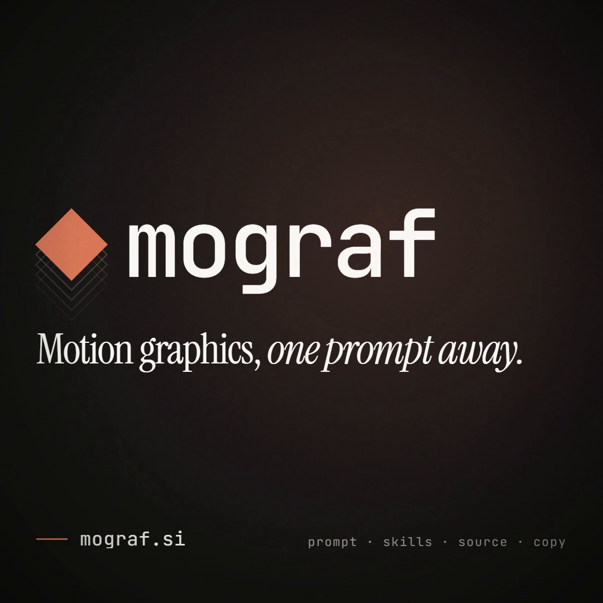

# mograf · free Claude Code motion skills

Two free [Claude Code](https://claude.com/claude-code) skills that make AI-generated motion graphics look less like a template. There's also a complete example piece you can run, and a curated list of the best Claude motion work going around right now.

[](https://mograf.si)

<!-- VIDEO: drag renders/video.mp4 into this README on github.com to get a user-attachments URL, then paste it on its own line here. -->

*The teaser above was made with Claude Code + HyperFrames. Its full kit (prompt, brief, storyboard, source and copy) is in [`examples/mograf-teaser-v2`](examples/mograf-teaser-v2).*

## What's in here

| | What it does |
|---|---|
| [`motion-review`](plugins/mograf/skills/motion-review/SKILL.md) | A studio critic. It looks at your frames, scores the piece on 9 dimensions (concept, composition, type, timing, choreography, transitions, depth, sound, finish), checks hard gates and an anti-slop list, then returns **APPROVE / POLISH / REWORK** with exact fixes ("3.4 s `#title`: replace the fade-up with a line mask, settle ease, 0.9 s"). Run it as a sub-agent so the model that built the piece doesn't grade its own work. |
| [`motion-craft-lite`](plugins/mograf/skills/motion-craft-lite/SKILL.md) | The core of our motion doctrine: 7 named ease tokens, video duration bands, 9 choreography rules and a "never do" list. Load it before any animation code. |
| [`examples/mograf-teaser-v2`](examples/mograf-teaser-v2) | One complete piece: prompt, brief, concept, storyboard, beats, copy and the HyperFrames source. Every third-party file is in its [assets ledger](examples/mograf-teaser-v2/ASSETS.md). |
| [`awesome-claude-motion.md`](awesome-claude-motion.md) | A curated, credited list of notable Claude Opus 5.5 / Claude Code motion pieces, plus tools, skills and learning links. |

The skills work with HyperFrames, GSAP and plain HTML/CSS. They also work with Remotion: the easing and choreography rules carry over, and the review commands have Remotion equivalents noted.

## Install

**As a plugin (recommended):**

```
/plugin marketplace add <owner>/mograf-public
/plugin install mograf@mograf
```

**Manual copy:**

```bash
git clone https://github.com/<owner>/mograf-public
mkdir -p ~/.claude/skills
cp -r mograf-public/plugins/mograf/skills/* ~/.claude/skills/
```

For a single project, copy the skills into that project's `.claude/skills/` instead.

To build and render video you also need a runtime. We use [HyperFrames](https://github.com/heygen-com/hyperframes) (`npx skills add heygen-com/hyperframes`) with GSAP.

## Quick start

Paste this into Claude Code:

```
Use motion-craft-lite. Make a 10 s, 1:1, 30 fps HyperFrames motion graphic for
<your product>: one idea, one signature moment around 4 s, a designed final frame held 1 s.
Then run motion-review as a fresh sub-agent on it and apply the top 3 fixes.
```

Already have a piece? Run `Review library/my-piece with motion-review` and read `review.md`.

## What the skills won't do

They won't give you a concept and they won't render anything by themselves. They are rules and a review loop, and the review only scores what it can actually see in frames. Expect the first pass on most AI-built pieces to come back POLISH or REWORK. That's the point.

## The full library

[**mograf.si**](https://mograf.si) is our paid library of studio-grade motion pieces. **Every piece ships with its prompt, skills, source and copy**, like the example here. The library also includes the director pipeline, the specialist skills (type choreography, transitions, depth/camera, sound sync) and the finishing stack that these free skills leave out.

## Contributing

Made something with Claude that belongs on the awesome list? See [CONTRIBUTING.md](CONTRIBUTING.md).

## License

mograf's original work here (skills, docs, the example's source and text) is [MIT](LICENSE). Fonts, HyperFrames registry code and gl-transitions keep their own licenses, listed in [THIRD_PARTY.md](THIRD_PARTY.md). GSAP and the sound effects are **not** redistributed here.
